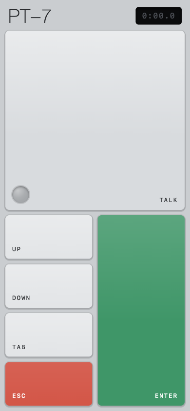
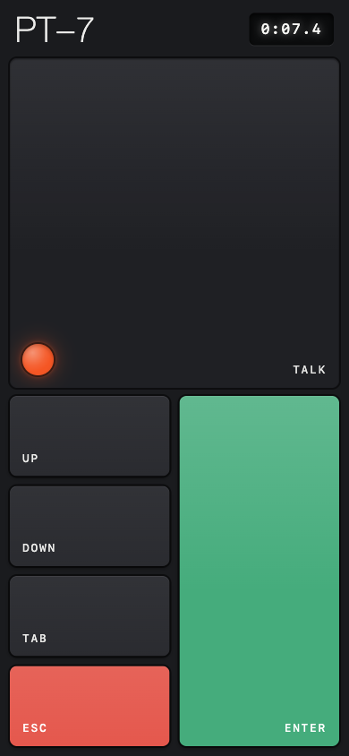

# PT-7

A pocket key deck for your Mac, PC, or Linux box.

<p>
  
  
</p>

Hold the big key to talk. Tap the rest to drive your terminal from across the room.

Made for dictating into [Handy](https://handy.computer) while using Claude Code. The look and name is a nod to Dieter Rams and Teenage Engineering's TP-7.

## how it works

Your computer serves a small page to your phone over Wi-Fi. No app, no cloud.

Every button presses a real key. The talk key holds right Command on a Mac, right Ctrl on Windows and Linux, whichever one you gave Handy for push-to-talk.

The lamp lights while you talk. The display counts your take, and blinks OFFLINE if your computer is unreachable.

Two hosts, same page: `init.lua` runs under Hammerspoon on a Mac, `pt7.py` runs anywhere else.

## setup, mac

1. Install [Hammerspoon](https://www.hammerspoon.org) and give it Accessibility permission.

2. In Terminal:

   ```sh
   git clone https://github.com/ptaranat/pt7.git
   ln -s "$PWD/pt7/init.lua" ~/.hammerspoon/init.lua
   ```

   Already have a Hammerspoon config? Add `dofile("/path/to/pt7/init.lua")` to it instead.

3. Reload Hammerspoon.

4. Open the Hammerspoon Console (menu bar icon, then Console). PT-7 prints your deck's private address there. Open it on your phone and Add to Home Screen.

5. Set your dictation app's push-to-talk key to right Command.

## setup, windows and linux

1. Install [uv](https://docs.astral.sh/uv/getting-started/installation/). It brings its own Python, so that is the only thing to install.

2. In a terminal:

   ```sh
   git clone https://github.com/ptaranat/pt7.git
   cd pt7
   uv run pt7.py
   ```

3. PT-7 prints two addresses, one by name and one by IP. Open whichever your phone can reach and Add to Home Screen. Windows has no Bonjour, so the name usually will not resolve and the IP one will.

4. Set your dictation app's push-to-talk key to right Ctrl.

On Linux the keys go through `uinput`, which needs permission once:

```sh
echo 'KERNEL=="uinput", MODE="0660", GROUP="input"' | \
  sudo tee /etc/udev/rules.d/99-pt7-uinput.rules
sudo udevadm control --reload-rules && sudo udevadm trigger
sudo usermod -aG input $USER
```

Log out and back in for the group. The first run tells you this too if you skip it. Injecting below the display server means X11 and Wayland both work.

On Windows the keys go through `SendInput`, no setup and no admin rights. One catch: Windows will not let a normal program type into an elevated window, so if your editor runs as administrator, run PT-7 as administrator too.

## keeping it running

`pt7.py` is executable and carries its own dependencies, so `./pt7.py` from anywhere works once uv is installed. To stop thinking about it entirely, start it at login.

On Linux, put this in `~/.config/systemd/user/pt7.service`, with your own paths (`which uv` and wherever you cloned):

```ini
[Unit]
Description=PT-7

[Service]
ExecStart=%h/.local/bin/uv run %h/pt7/pt7.py
Restart=always

[Install]
WantedBy=default.target
```

```sh
systemctl --user enable --now pt7
journalctl --user -u pt7 -f    # the address it prints, and every key press
```

Add `loginctl enable-linger $USER` if you want the deck up before you log in.

On Windows, save a `pt7.cmd` next to `pt7.py`:

```bat
@echo off
cd /d "%~dp0"
uv run pt7.py
```

Press Win+R, run `shell:startup`, and drop a shortcut to it in the folder that opens. Set the shortcut's Run to Minimized so it stays out of your way.

## your own keys

On a Mac, edit the `KEYS` table in `init.lua`:

```lua
{ id = "escape", label = "esc", keycode = 0x35, color = "red" },
```

The `talk` role is the big key, `primary` is the tall one, the rest stack in the left column. [Keycode reference](https://eastmanreference.com/complete-list-of-applescript-key-codes).

Add `repeats = true` to a key and holding it repeats, at your Mac's key repeat rate. The arrow keys ship this way.

Elsewhere, edit the `KEYS` list in `pt7.py`. Same fields, except `key` is a name each platform maps for itself:

```python
{"id": "escape", "label": "esc", "key": "esc", "color": "red"},
```

Adding a key means adding it to the `VK` and `CODE` tables in the same file. `"repeats": True` works the same way, though on Linux the display server already repeats held keys, so the host stays out of it.

`ui.html` is re-read on every page load: edit, refresh, done.

## tailscale

Already on [Tailscale](https://tailscale.com)? Your deck gets end-to-end encryption and works away from home.

On your phone, drop the `.local`: with MagicDNS, `http://<your-machine-name>:8765` reaches it from anywhere. Same port, same private path. This is also the easy fix for a Windows host, whose name your phone cannot look up otherwise.

To hide the deck from your Wi-Fi entirely, bind it to your Tailscale IP (`tailscale ip -4`). In the Hammerspoon Console, run:

```lua
hs.settings.set("PT7.interface", "100.x.y.z")
```

Reload Hammerspoon. For `pt7.py`, set the same address in the environment:

```sh
PT7_INTERFACE=100.x.y.z uv run pt7.py
```

Only devices on your tailnet can reach the deck now. Undo with `hs.settings.clear("PT7.interface")`, or by dropping the variable.

## fine print

The deck lives at a private address. Treat it like a key: anyone who has it can press these keys on your machine. Traffic is unencrypted, so use a network you trust.
